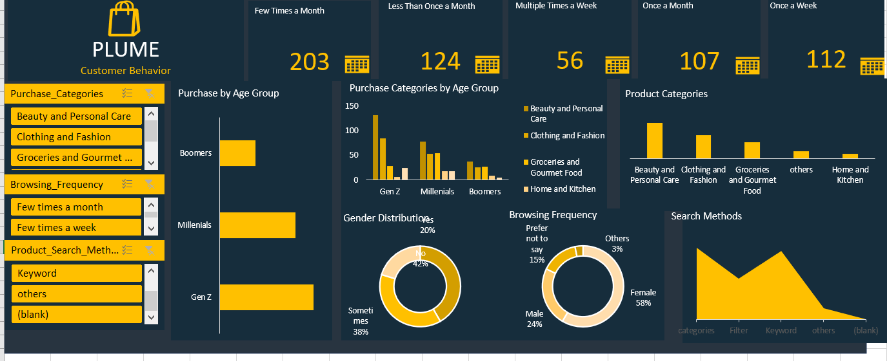
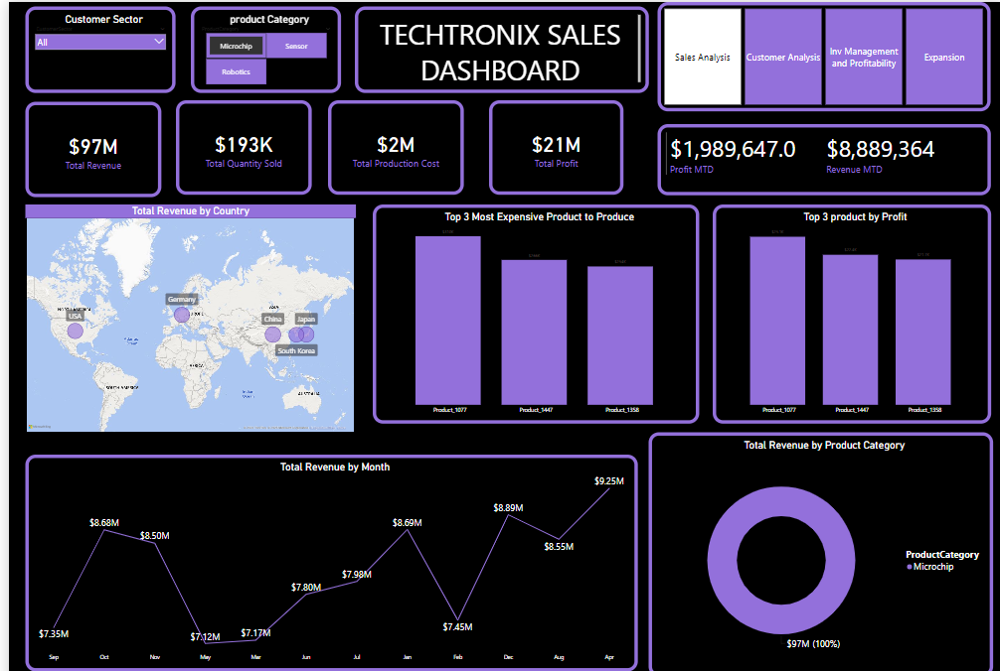
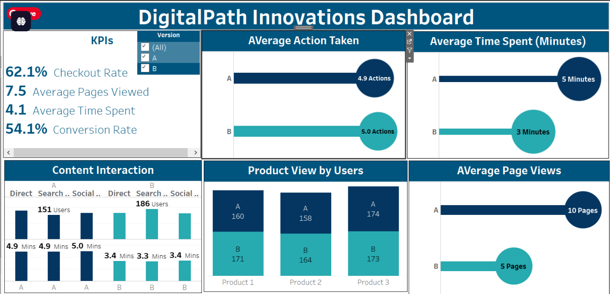
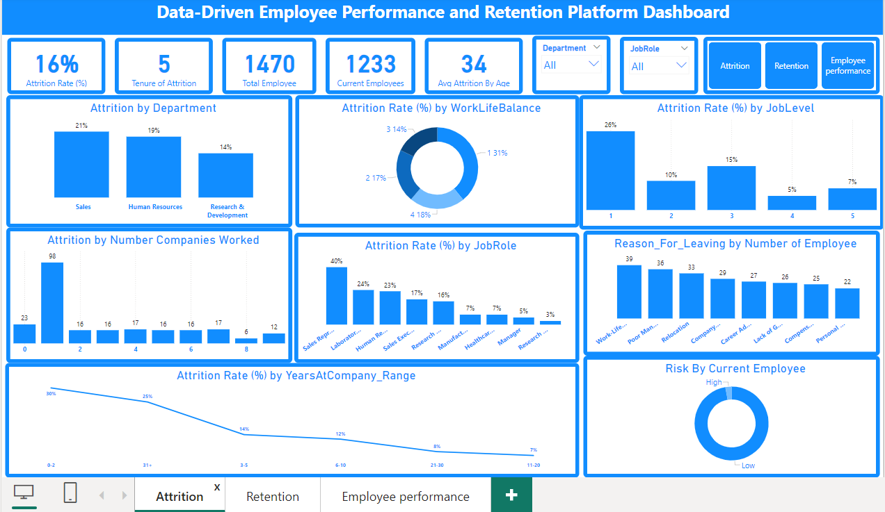
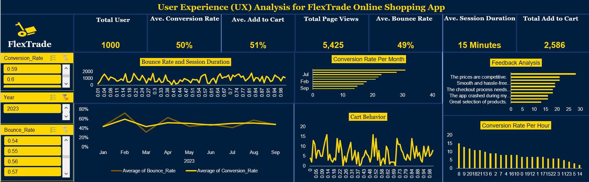
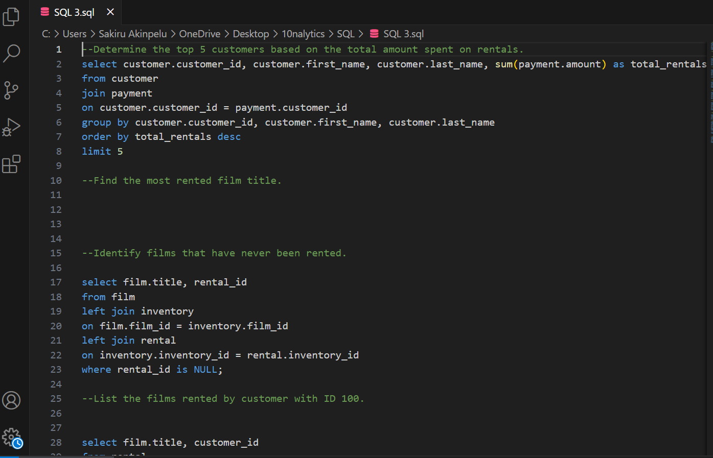

<!--Section 1: Introduce your self-->
## ABOUT ME

Hello! I'm Sakiru Akinpelu 🤓, a data analyst, Proactive and results-oriented Data Analyst with four years of experience in translating complex data into actionable insights to drive business decisions. Skilled in Excel, SQL, and data visualization tools like Tableau and Power BI, with a proven ability to create scalable reporting tools and optimize key performance indicators. Strong business acumen, hands-on attitude, and a passion for end-to-end project management. Committed to diversity, inclusion, and bringing my authentic self to work every day..

<!--Mention your top/relevant skills here - core and soft skills-->
## CORE AND TECHNICAL SKILLS 

**- ✅ Data Analytics** 

**- ✅ Data Modelling**

**- ✅ Data Visualization**  

**- ✅ Modelling**

**- ✅ SQL**   

**- ✅ Problem Solving**

**- ✅ Teamwork and Collaboration**  

**- ✅ Communication Skills  (Written and Verbal)**

**- ✅ Planning/organization skills** 

**- ✅ MS Excel**

**- ✅ Power BI**         

**- ✅ Tableau**

**- ✅ Microsoft Fabrics**          

**- ✅ Google**

**- ✅ Analytics**

<!--Section 2: List 3-4 key projects-->
## MY PORTFOLIO 

**A glimpse of some of the projects I've worked on.**

**StrideStyle Retailer Performance Analysis using PowerBI.**

StrideStyle Footwear is a leading manufacturer specializing in footwear, offering a wide range of trendy and high-quality shoes for men, women, and children. With a diverse selection of brands and styles, StrideStyle Footwear aims to cater to the fashion preferences and lifestyle needs of its diverse customer base. Operating both online and
through brick-and-mortar stores across multiple locations, the company is committed to providing exceptional customer service and fostering a memorable shopping experience.

[Read More](https://www.linkedin.com/posts/sakiruakinpelu_dataanalytics-powerbi-dashboard-activity-7219370239552028676-LjJ5?utm_source=share&utm_medium=member_desktop)

**Plume: A Customer Behaviour Analysis using Excel.**

Plume, a well-established e-commerce retailer, is, looking to gain deeper insights into customer behaviour to improve their online shopping experience and boost sales. ABC Retail has observed that their e-commerce platform is not achieving the desired level of success, given the substantial investment made in its development. The return on investment (ROI) for their online store has been lower than anticipated, indicating a need to enhance its revenue-generating capabilities.

[Read More](https://www.linkedin.com/posts/sakiruakinpelu_sakirudataanalyticsjourneywith10alytics-dataanalytics-activity-7213181313309184001-qmG5?utm_source=share&utm_medium=member_desktop)

**TECHTRONIX: A Sales, Customer and Product Analysis using PowerBI.**

Techtronix Innovations, a forefront player in the microchip and robotics industry, is encountering challenges in streamlining its sales strategies, optimizing production planning, and pursuing market expansion. The company boasts an extensive portfolio that caters to automotive, consumer electronics, and industrial sectors. However, it grapples with demand unpredictability, inventory management inefficiencies, and the identification of profitable market opportunities.

Over the previous year, Techtronix Innovations has meticulously compiled a dataset encompassing each transaction, encompassing sales data, customer interactions, product specifics, and financial metrics. This dataset presents an invaluable opportunity for in-depth business performance analysis, trend identification, and insight extraction to inform strategic decisions.

<a href="pdf 4 PowerBI.pdf">Download the Report here (pdf file)</a>

**DigitalPath Innovations User Experience Analysis using Tableau.**

DigitalPath Innovations, a leader in digital marketing solutions, seeks to enhance its website's user

experience to improve engagement metrics, conversion rates, and customer satisfaction. The

company has conducted an A/B test over a two-week period, presenting two distinct versions of its

webpage (Version A and Version B) to a randomized group of users. This experiment aims to

identify which webpage version performs better across various user engagement metrics.

<a href="pdf 1 Tableau.pdf">Download the Report here (pdf file)</a>

**Data-Driven Employee Performance and Retention Platform Analysis Using PowerBI.**

To create a platform that predicts employee attrition, analyzes performance trends, and recommends personalized retention strategies based on historical and real-time data 

<a href="Pdf 2 Team Vega Project Presentation .pdf">Download the Report here (pdf file)</a>

[Read More](https://www.linkedin.com/pulse/predictive-modeling-hypothesis-testing-using-titanic-dataset-anietie/)

**User Experience (UX) Analysis for FlexTrade Online Shopping App using Excel.**

FlexTrade is a well-known company in the online shopping world. They have been
making shopping easier and better for a long time. They sell all kinds of things, from
electronics to clothes.

Their app is designed to be easy to use, hoping to make shopping fun and simple for
everyone.

FlexTrade wants to keep improving their app to make sure they stay ahead in the
competitive online shopping market. This project will look into how they can make their
app even better for users.

<a href="pdf 5 Excel flextrade.pdf">Download the Report here (pdf file)</a>

**From Overstock to On-Point: T.T Inc.'s Inventory Optimization Analysis.**

The team is having a supply chain strategy meeting for the following year, and I was asked to present insights from the inventory data to inform the inventory optimization strategy and enhance operational efficiency.
I have been asked by the Head of Supply Chain Management to present data insights and optimization strategies for inventory management. Within the Supply Chain Management team, The objectives are:

● Optimize inventory levels to minimize overstock and understock situations.

● Understanding seasonal trend of sales for different products.

● Improve customer satisfaction by ensuring product availability.

<a href="PDF 3 SQL.pdf">Download the Report here (pdf file)</a>

## CONTACT DETAILS

*Let’s connect and see how we can make a difference together!*
<table>
  <tbody>
    <tr>
      <td>📧</td>
      <td><a href="mailto:sakiruakinpelu1@gmail.com">sakiruakinpelu1@gmail.com</a></td>
    </tr>
    <tr>
      <td>📞</td>
      <td>(234) 808-012-6735</td>
    </tr>
    <tr>
      <td>📍</td>
      <td>Abuja, Nigeria</td>
    </tr>
    <tr>
      <td>⬇️</td>
      <td><a href="Sakiru Akinpelu Ayobanji CV (2).pdf">Download my CV</a></td>
    </tr>
    <tr>
      <td>🌐</td>
      <td><a href="https://www.linkedin.com/in/sakiruakinpelu/">Check me out on LinkedIn</a></td>
    </tr>
  </tbody>
</table>
