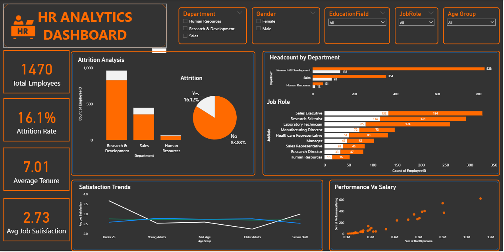
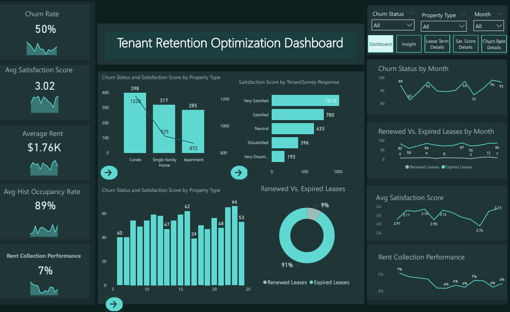
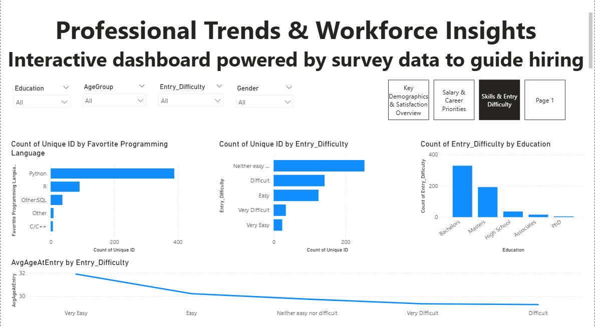
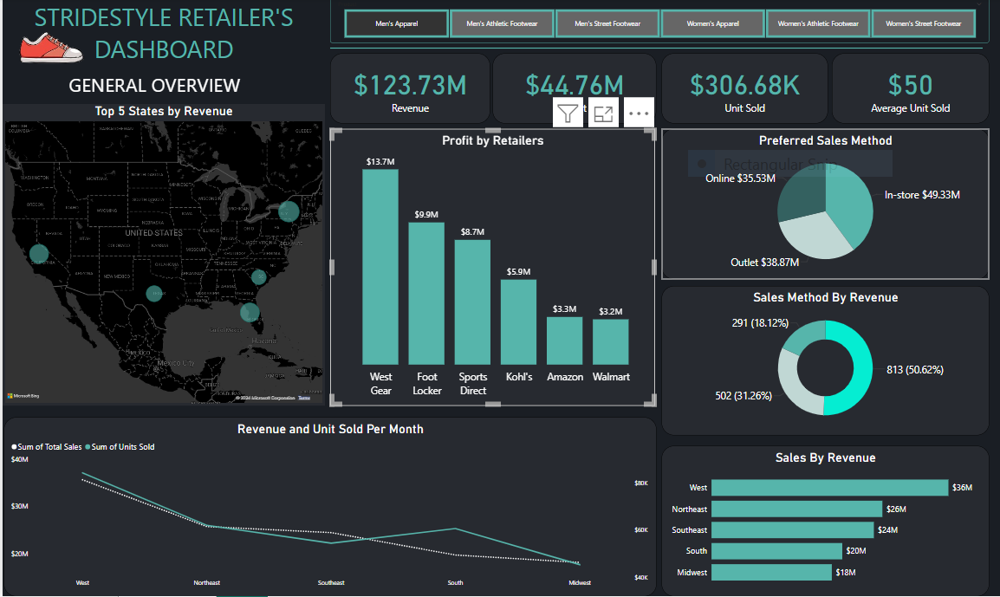
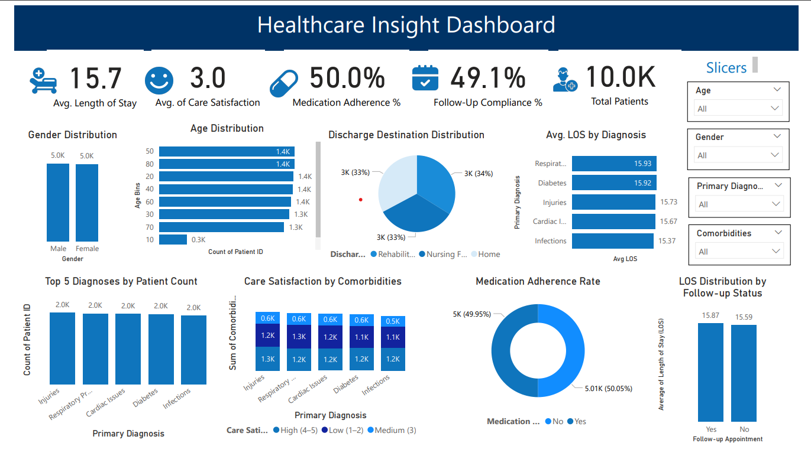
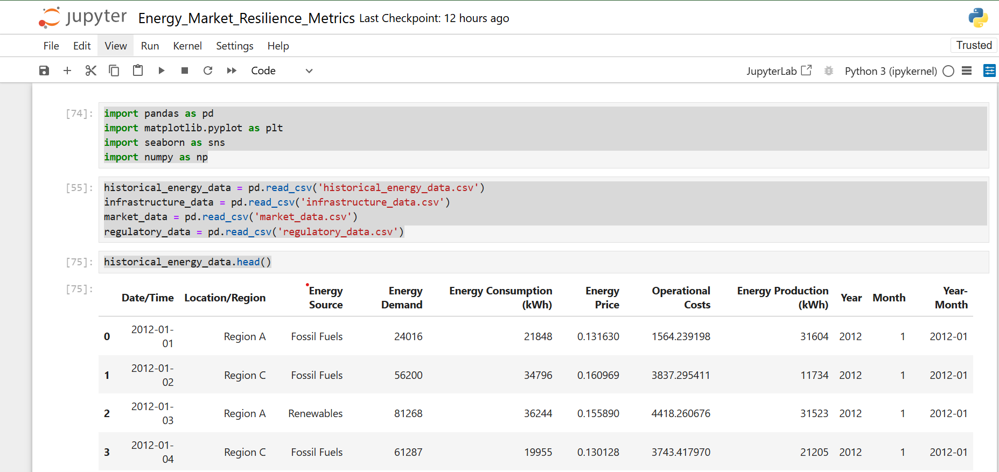
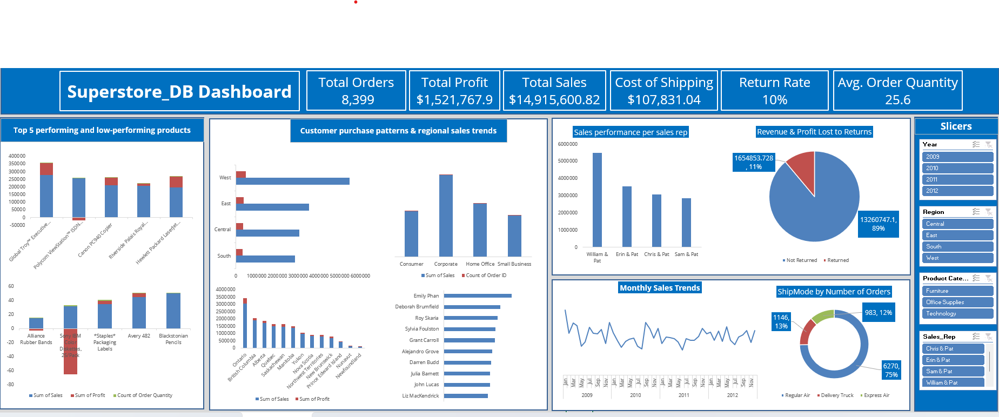
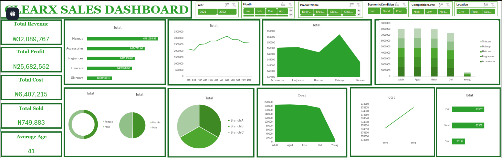
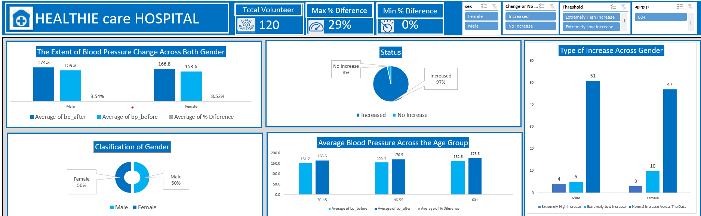

<!--Section 1: Introduce your self-->
## ABOUT ME

Hello! I'm Sakiru Akinpelu 🤓, a data analyst, Proactive and results-oriented Data Analyst with four years of experience in translating complex data into actionable insights to drive business decisions. Skilled in Excel, SQL, and data visualization tools like Tableau and Power BI, with a proven ability to create scalable reporting tools and optimize key performance indicators. Strong business acumen, hands-on attitude, and a passion for end-to-end project management. Committed to diversity, inclusion, and bringing my authentic self to work every day..

**4 Years Experience**

**+20 Total Projects**

<!--Mention your top/relevant skills here - core and soft skills-->
## Tools and Technologies 

**- Dashboarding**     

**- Data Visualization**

**- Descriptive Analytics**  

**- Diagnostic Analyticsg**

**- Predictive Analytics**   

**- Prescriptive Analytics**

**- KPI Monitoring and Reporting**  

**- Communication Skills  (Written and Verbal)**

**- Planning/organization skills** 

**- Advanced Excel Analytics**

**- Pivot Tables (Excel)**         

**- Data Cleaning and Transformation**

**- Microsoft Fabrics**          

**- SQL for Data Analytics**

**- Statistical Analysis**

**- Time Series Analysis**

**- Performance Dashboards**

**- Customer Analytics**

**- Marketing Analytics**

**- Operational Analytics**

**- Power BI for Business Analytics**

**- Tableau for Business Insights**

**- Google Data Studio for Analytics**

**- Survey Data Analysis**

**- Visual Storytelling with Datas**

**- DAX (Data Analysis Expressions) in Power BI**

**- Excel Macros for Automation**

**- Programming (Python)**

**- Data Wrangling and Cleaning**

<!--Section 2: List 3-4 key projects-->
## MY PORTFOLIO 

*A glimpse of some of the projects I've worked on.*

**HR Analytics Dashboard – Power BI**

This project involved designing and developing an interactive HR Analytics Dashboard using Power BI to support data-driven decision-making within a Human Resources (HR) context. The objective was to analyze employee-related metrics such as attrition, satisfaction, tenure, and performance across various departments and demographic segments.

The dashboard was built using a real-world HR dataset, focusing on transforming raw data into actionable insights that can help HR managers:

Identify high-risk attrition areas

Monitor employee satisfaction trends

Evaluate performance in relation to compensation

Understand workforce distribution across roles, departments, and age groups

As part of this project, I applied core data analytics skills including data cleaning, DAX calculations, data modeling, and visualization best practices. The final deliverable is a professional, interactive dashboard that allows stakeholders to explore critical HR metrics through dynamic filters and drill-down capabilities.

<a href="HR Analytics Dashboard new Presentation Power BI.pdf">Download the Report here (pdf file)</a>

**Tenant Retention Optimization: Building an Interactive Power BI Dashboard for Residential Real Estate Excellence.**

HomeVibe Properties, a distinguished presence in the residential real estate sector, boasts an extensive portfolio of apartment complexes and single-family rental properties across multiple cities. Renowned for their commitment to providing exceptional housing solutions, HomeVibe Properties has consistently delivered quality living experiences, fostering vibrant communities. In a rapidly evolving real estate landscape, the company's adaptability, meticulous attention to detail, and unwavering pursuit of excellence have established it as a leader in the industry.

However, within the ever-changing real estate market, HomeVibe Properties faces a distinct challenge—tenant retention. To address this critical concern comprehensively and unlock opportunities for sustainable growth, HomeVibe Properties embarked on a journey to leverage Power BI, a powerful business intelligence tool, to develop an end-to-end solution. This case study delves into HomeVibe Properties' strategic utilization of Power BI, outlining the entire workflow from data collection to an interactive dashboard, aimed at optimizing tenant retention and solidifying its position as a beacon of excellence in the residential real estate industry.

[Read More](https://www.amdari.io/profile/sakiru-akinpelu-494?page-tab=3&portfolio-id=1821)

**Analyzing Professional Trends Through Power BI**

In a rapidly evolving job market, data-driven insights are essential for strategic hiring, workforce planning, and career development. In this capstone project, I served as a Data Visualization Consultant tasked with transforming a comprehensive professional survey dataset into a compelling, interactive Power BI dashboard tailored for HR professionals, business leaders, and career advisors.

The dataset featured responses from professionals across different regions, age groups, educational backgrounds, and skillsets. I followed a full data analysis lifecycle—cleaning raw data, modeling relationships, and building insightful visuals to uncover key trends such as salary distribution, job satisfaction metrics, intent to switch jobs, and skill demand.

The final dashboard empowers stakeholders to:

Identify high-earning professions and the impact of education on income

Understand drivers of job satisfaction and mobility

Detect trends in skill acquisition across experience levels

Make informed, data-backed workforce decisions

This project highlights my ability to turn complex survey data into actionable business intelligence using Power BI.

<a href="Analyzing Professional Trends Workforce Insights Dashboard Port.pdf">Download the Report here (pdf file)</a>

**StrideStyle Retailer Performance Analysis using PowerBI.**

StrideStyle Footwear is a leading manufacturer specializing in footwear, offering a wide range of trendy and high-quality shoes for men, women, and children. With a diverse selection of brands and styles, StrideStyle Footwear aims to cater to the fashion preferences and lifestyle needs of its diverse customer base. Operating both online and
through brick-and-mortar stores across multiple locations, the company is committed to providing exceptional customer service and fostering a memorable shopping experience.

[Read More](https://www.linkedin.com/posts/sakiruakinpelu_dataanalytics-powerbi-dashboard-activity-7219370239552028676-LjJ5?utm_source=share&utm_medium=member_desktop)

**Healthcare Dashboard with Power BI**

This project involved the end-to-end development of an interactive Healthcare Insights Dashboard using Power BI. The objective was to analyze patient data to uncover trends in treatment outcomes, length of stay, medication adherence, and overall care satisfaction.

By transforming raw health records into actionable visuals, the dashboard supports data-driven decision-making for healthcare managers and stakeholders. The project showcases my proficiency in data modeling, DAX, Power Query, and dashboard design principles with a focus on real-world KPIs relevant to hospital operations and patient outcomes.

[Read More](https://www.linkedin.com/posts/sakiruakinpelu_powerbi-dataanalytics-healthcareanalytics-activity-7346458575214448640-QbHi?utm_source=share&utm_medium=member_desktop&rcm=ACoAAC59EgoBgS7eKl27blUUncLTGFkG0fbcbgs)

**Energy Market Resilience Metrics: Analyzing Vulnerabilities and Preparing for Disruptions using Python**

In this project, I collaborated with Amdari to support Energix Enterprise, a major player in the Energy and Utilities sector, in improving its market resilience. The project leveraged Python for deep data analysis, identifying vulnerabilities in energy production, market dynamics, infrastructure, and regulatory compliance.

[Read More](https://www.linkedin.com/posts/sakiruakinpelu_dataanalytics-energymarket-resilienceplanning-activity-7353328242893668352-ndGP?utm_source=share&utm_medium=member_desktop&rcm=ACoAAC59EgoBgS7eKl27blUUncLTGFkG0fbcbgs)

**Superstore Sales Analysis & Interactive Dashboard**

The Superstore Sales Analysis Dashboard project was developed to explore and uncover actionable business insights from a comprehensive retail dataset. Using Excel's advanced data analysis tools, I analyzed over 8,000 orders spanning four years, focusing on product performance, customer behavior, regional trends, and return rates.

The objective was to create a dynamic, interactive dashboard that not only summarizes sales data but also guides strategic decisions regarding inventory, customer segmentation, and sales optimization.

<a href="Superstore_Dashboard_Insights_Presentation.pptx">Download the Report here (pdf file)</a>

**Empowering Decision-Makers: Innovative Sales Data Visualization through Interactive Dashboards**

CLEARX Cosmetics is a new cosmetic company operating in Nigeria. With a dedicated team of 25 staff members, the company specializes in producing and distributing a wide range of cosmetic products, including skincare, makeup and fragrances. CLEARX Cosmetics have a reputation for offering high-quality, locally-sourced products that cater to the diverse beauty needs of its Nigerian customers. The company operates two branches strategically located in different parts of Nigeria, serving as hubs for product distribution and customer engagement.

In just 2 years in business, CLEARX Cosmetics has continually expanded its product range to meet the evolving beauty needs of its customers. The company invests in research and development to stay at the forefront of cosmetic innovation. This commitment has allowed CLEARX Cosmetics to offer a diverse portfolio of that includes skincare items like moisturizers, cleansers, and serums, makeup products such as foundations, lipsticks, and eyeshadows, as well as an array of fragrances and fashion accessories.

CLEARX Cosmetics was established in 2021 and it is a cosmetics company in Nigeria known for its commitment to quality, innovation, and community engagement. With a diverse product range, locally-sourced ingredients, and a customer-centric approach, the company has solidified position as a trusted name in the Nigerian beauty industry and is poised for further growth and expansion.

[Read More](https://www.amdari.io/profile/sakiru-akinpelu-494?page-tab=3&portfolio-id=793)

**Plume: A Customer Behaviour Analysis using Excel.**

Plume, a well-established e-commerce retailer, is, looking to gain deeper insights into customer behaviour to improve their online shopping experience and boost sales. ABC Retail has observed that their e-commerce platform is not achieving the desired level of success, given the substantial investment made in its development. The return on investment (ROI) for their online store has been lower than anticipated, indicating a need to enhance its revenue-generating capabilities.

[Read More](https://www.linkedin.com/posts/sakiruakinpelu_sakirudataanalyticsjourneywith10alytics-dataanalytics-activity-7213181313309184001-qmG5?utm_source=share&utm_medium=member_desktop)

**TECHTRONIX: A Sales, Customer and Product Analysis using PowerBI.**

Techtronix Innovations, a forefront player in the microchip and robotics industry, is encountering challenges in streamlining its sales strategies, optimizing production planning, and pursuing market expansion. The company boasts an extensive portfolio that caters to automotive, consumer electronics, and industrial sectors. However, it grapples with demand unpredictability, inventory management inefficiencies, and the identification of profitable market opportunities.

Over the previous year, Techtronix Innovations has meticulously compiled a dataset encompassing each transaction, encompassing sales data, customer interactions, product specifics, and financial metrics. This dataset presents an invaluable opportunity for in-depth business performance analysis, trend identification, and insight extraction to inform strategic decisions.

<a href="pdf 4 PowerBI.pdf">Download the Report here (pdf file)</a>

**DigitalPath Innovations User Experience Analysis using Tableau.**

DigitalPath Innovations, a leader in digital marketing solutions, seeks to enhance its website's user

experience to improve engagement metrics, conversion rates, and customer satisfaction. The

company has conducted an A/B test over a two-week period, presenting two distinct versions of its

webpage (Version A and Version B) to a randomized group of users. This experiment aims to

identify which webpage version performs better across various user engagement metrics.

<a href="pdf 1 Tableau.pdf">Download the Report here (pdf file)</a>

**Data-Driven Employee Performance and Retention Platform Analysis Using PowerBI.**

To create a platform that predicts employee attrition, analyzes performance trends, and recommends personalized retention strategies based on historical and real-time data 

<a href="Pdf 2 Team Vega Project Presentation .pdf">Download the Report here (pdf file)</a>

**User Experience (UX) Analysis for FlexTrade Online Shopping App using Excel.**

FlexTrade is a well-known company in the online shopping world. They have been
making shopping easier and better for a long time. They sell all kinds of things, from
electronics to clothes.

Their app is designed to be easy to use, hoping to make shopping fun and simple for
everyone.

FlexTrade wants to keep improving their app to make sure they stay ahead in the
competitive online shopping market. This project will look into how they can make their
app even better for users.

<a href="pdf 5 Excel flextrade.pdf">Download the Report here (pdf file)</a>

**From Overstock to On-Point: T.T Inc.'s Inventory Optimization Analysis.**

The team is having a supply chain strategy meeting for the following year, and I was asked to present insights from the inventory data to inform the inventory optimization strategy and enhance operational efficiency.
I have been asked by the Head of Supply Chain Management to present data insights and optimization strategies for inventory management. Within the Supply Chain Management team, The objectives are:

● Optimize inventory levels to minimize overstock and understock situations.

● Understanding seasonal trend of sales for different products.

● Improve customer satisfaction by ensuring product availability.

<a href="PDF 3 SQL.pdf">Download the Report here (pdf file)</a>

**PULSATING ENERGIES: unraveling the Impact of Energy Red Bull on Blood Pressure Using Excel**

The hospital's management is concerned about the growing popularity of energy drinks, particularly Red Bull, and its potential effects on blood pressure levels among individuals. 

Recognizing my expertise in data analysis, and entrust me with the task of running a comprehensive analysis on a dataset of 120 volunteers.

The hospital administration wants me to unveil the story hidden within the data, to deliver a
captivating narrative that will educate both staff and patients about the potential risks associated with consuming energy drinks. They seek insights into the impact of Red Bull on blood pressure, with a specific focus on gender disparities, age-related variations, and outlier responses.

<a href="HEALTHIE CARE Hospital.pptx">Download the Report here (pdf file)</a>

## CONTACT DETAILS

*Let’s connect and see how we can make a difference together!*
<table>
  <tbody>
    <tr>
      <td>📧</td>
      <td><a href="mailto:sakiruakinpelu1@gmail.com">sakiruakinpelu1@gmail.com</a></td>
    </tr>
    <tr>
      <td>📞</td>
      <td>(234) 808-012-6735</td>
    </tr>
    <tr>
      <td>📍</td>
      <td>Abuja, Nigeria</td>
    </tr>
    <tr>
      <td>⬇️</td>
      <td><a href="Sakiru Akinpelu Ayobanji CV (2).pdf">Download my CV</a></td>
    </tr>
    <tr>
      <td>🌐</td>
      <td><a href="https://www.linkedin.com/in/sakiruakinpelu/">Check me out on LinkedIn</a></td>
    </tr>
  </tbody>
</table>

## Available For Hire 🚀 Crafting Digital Experiences 🎨
